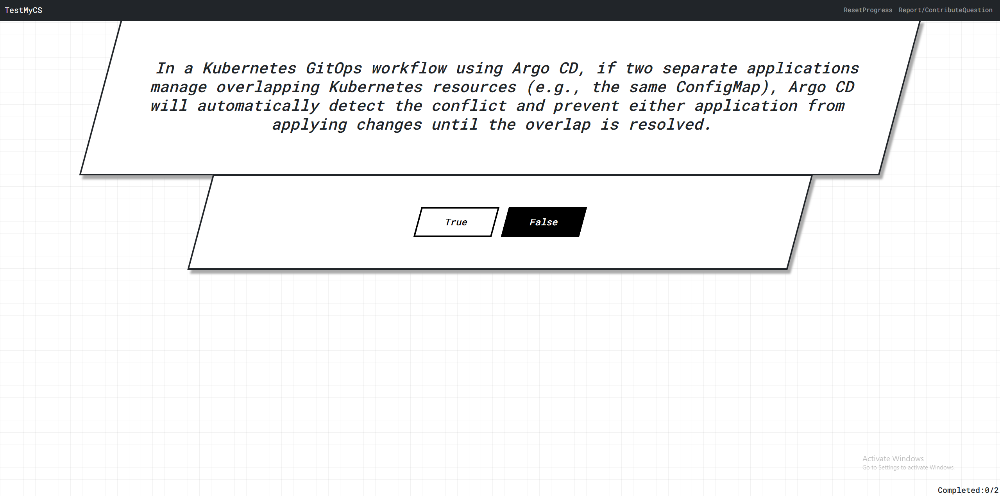

## TestMyCS.com

Test your breadth of CS knowledge with easily-digestible true/false questions!

This project was developed to explore the entire software lifecycle. It touches on many DevOps aspects, including 
cloud hosting, IaC, containerized deployments, artifact storage, CI/CD, vulnerability scans, health checks, and more.

### Report a question

All the questions can be found in `init_db.py`. To report incorrect information, feel free to open an issue.

### Contribute a question

Open an issues page. It can be on any topic related to CS, as long as it's true/false. Unless the question is 
self-explanatory, also provide an explanation for the correct answer.
